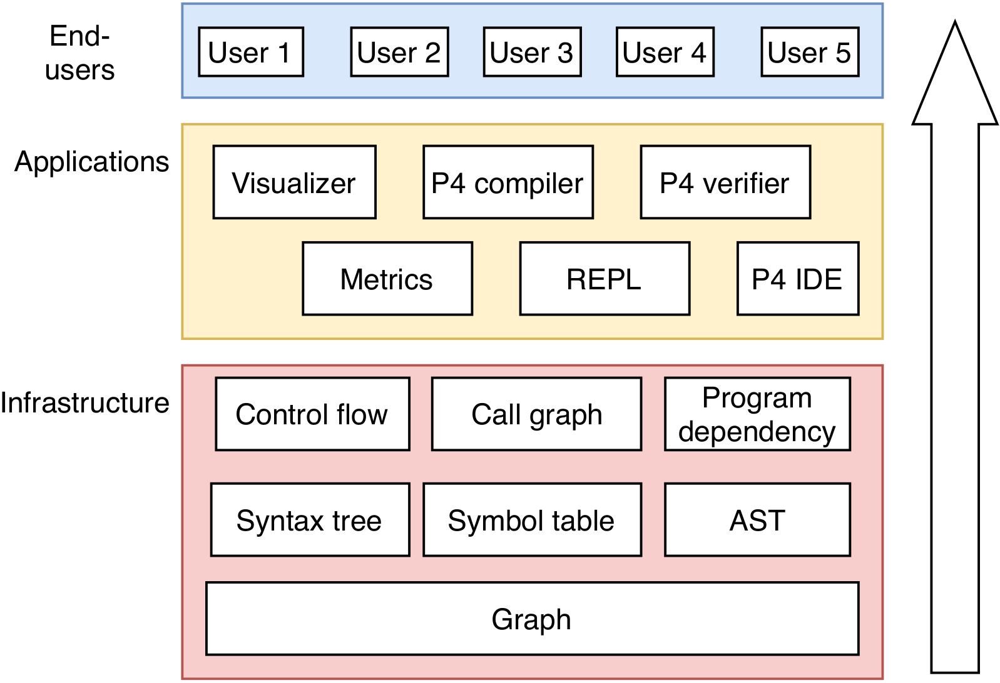

# P4 code analysis

Copyright &copy; 2020 ELTE IK


## Description

NAME is a static code analysis framework for the P4 language. We intend NAME to be a knowledge base or infrastructure that can host various applications, such as compilers, code comprehension tools, IDEs, and formal verification tools.

Implemented features (applications):

- Visualization 
- Graph query REPL
- Verification of various safety-properties 

Implemented features (infrastructure):

- Syntax tree (based on P4 specs)
- Abstract syntax tree 
- Symbol table
- Call analysis
- Control flow analysis
- All information is stored in a knowledge graph (a graph database with Gremlin API).
- Several other features (such as program dependency and data flow analysis) are planned.


## Installation

### Current release

### Dependencies

## Usage

NAME has two kinds of users: 

- **End-users** only use existing applications. 
- **Application developers** mainly use the infrastructure to create new applications, but occasionaly they also act as end-users and use existing applications that help in development (e.g. they visualise the P4 knowledge graph, or experiment with graph queries). 

In this section, we address end-users. Application developers working with the infrastructure should explore the [Contributors](TODO) section. 

NAME has a layered architecture. End-users only interact with applications. Applications in turn interact with knowledge graph in the infrastructure layer.

{ width=40% }


All built-in applications of NAME can be launched from the command line interface (CLI). For example, assuming you store a P4 program at path `$EXAMPLES/basic.p4`{.sh}, and want launch the graph query REPL, just navigate into the directory where you store `NAME-x-y-z.jar`{.sh} and fire up NAME like this in your terminal:

```sh
$ NAME repl $EXAMPLES/basic.p4
```

By passing `repl` as the first argument, you tell NAME to launch the application named `repl`. The second argument -- a file name -- will be passed to the REPL application. In turn, the REPL will load the file into the knowledge graph (unless it is loaded already), and start accepting your user inputs (valid queries in Gremlin-Java). For more information on using REPL, see [REPL](TODO).


Another example is graph visualization, which was implemented as another application:

```sh
$ NAME draw $EXAMPLES/basic.p4 syntax-tree control-flow
```

Again the first argument tells NAME to launch the visualizer application with the following arguments. Specifically, the visualizer will load the file into knowledge graph (unless it is loaded already), and then show you a subgraph that contains only the syntax tree and control flow edges. For more information on graph visualization, see [Visualizer](TODO).


Finally, to formally verify that `$EXAMPLES/basic.p4`{.sh} is bug-free (at least with respect some bugs), simply run:

```sh
$ NAME verify $EXAMPLES/basic.p4
```

For more information on P4 formal verification, see [Verification](TODO).


## Contributing

It should be possible to import the repository root as a folder in VSCode or [VSCodium](https://vscodium.com/).

Target is Java 8. 

Recommended extensions for VSCode: Java Extension Pack (Microsoft), Language Support for Java (Red Hat), Maven for Java (Microsoft).  

For visualisation, you will need [Graphviz](https://graphviz.org/download/) (tested with 2.38.0).

For running the project using VSCode, you can set arguments for launching `controller.Main` (current file) inside `launch.json`.

For running the project outside VSCode, you have to add arguments inside `exec-maven-plugin` plugin in the `pom.xml` inside the `controller` module, e.g.:

```xml
<mainClass>controller.Main</mainClass>
<arguments>
  <argument>draw</argument>
  <argument>--help</argument>
</arguments>
```

Then, you can run the project with the command:

```sh
$ mvn exec:java
```

Or with less Maven noise: 

```sh
$ mvn exec:java -pl controller
```


### Gremlin

The P4 knowledge graph resides in a TinkerPop graph database. Database queries for TinkerPop are graph traversals written in the Gremlin programming language. Basically, Gremlin is a functional programming language, and programs are descriptions of the graph paths that you want to traverse, and the side-effects you want to set off during your traversal (somewhat similar to XQuery).

- Tutorial: https://tinkerpop.apache.org/docs/current/#tutorials
- Cookbook: http://kelvinlawrence.net/book/PracticalGremlin.html
- Reference documentation: https://tinkerpop.apache.org/docs/current/reference/#graph-traversal-steps
- Gremlin white paper: https://arxiv.org/pdf/1508.03843.pdf
- Javadoc:
  * http://tinkerpop.apache.org/javadocs/3.4.8/full/org/apache/tinkerpop/gremlin/structure/package-summary.html
  * http://tinkerpop.apache.org/javadocs/3.4.8/full/org/apache/tinkerpop/gremlin/process/traversal/package-summary.html

### Goals

- **Open platform:** The P4 code analysis platform is intended as an open support structure for all implementations of optimising compilers, IDEs (incl. LSP-compliant ones), code comprehension dashboards, formal verification tools, etc. targeting the P4 programming language.
- **Data-driven:** Don't work on the code, work on the data! It doesn't matter *how* a static analysis procedure delivers its results, as long as these results are correct. What matters is *what* information does it need, and *what* information does it provide. This information is easily visualised, verified, and built upon.
- **Test-driven:** Clear input requirements and output guarantees are easy to turn into pre- and postconditions for testing and verification. A strong testing framework aids development both in validating new analysers and integrating validated analysers in the existing code base (CI/CD). 
- **Knowledge-based:** Static analysis extracts new information from program code without executing the program code. In other words, any static analysis procedure is an intelligent expert inferring new facts from existing facts. At the end of the chain there is knowledge: useful information that can be easily processed by human experts (developers, engineers, and tech managers) and application-specific software.
- **Graph-based:** Most data structures utilised in static analysis are trees and DAGs. Then, it makes sense to store all facts in one big, uniform, graph-shaped universe, where everything is connected to everything, and every information is just one link away. This universe is founded upon an efficient and multifaceted infrastructure provided by a state of the art graph database.
- **Distributed:** Where and when static analysis queries are executed is constrained as little as possible. This enables concurrent query execution that, in turn, boosts availability and efficiency at the same time.

### Planned architecture

{ width=50% }


### Current code structure 

The code base is modular, and all modules are in the root directory (a requirement by Maven for multi-module projects). In theory each module could be developed and stored in a separate git repository, and then imported as submodule in the main project repository. 

- `blackboard`: Knowledge graph (Gremlin Server) and possibly further data access layers. 
- `broker`: Component for coordinating access to the `blackboard` by various actors. Currently implemented as a DAG in Ant.
- `experts-...`: Experts (actors, knowledge sources) that know how to derive new information from existing knowledge. When these are invoked by the `broker`, they connect to the `blackboard`, analyse its content, and add new information.
- `application-...`:  TODO
- `ontology`: Metadata shared between actors that prescribes/describes what kind of data they should put into the database.

### How to create a new module?

1. Create a new Maven project in the root folder. In VSCode there is a button for this (*Create Maven project*), and it will automatically perform the following steps: 
    a. Update the `modules` element in the root `pom.xml` with the name of the new module.
    b. Include the `parent` element in the `pom.xml` of the new module
2. Build your new module for the first time. In VSCode, you can do this by restarting VSCode
3. Add your new module as a `runtime` dependency for the `broker` module in the `pom.xml` of the `broker`. This ensures that Java will find your classes when `broker` is executed.


### How to implement an application?

Note that the main class of the actual Java software is in the `broker`. You implement your application as a module, and the `broker` will discover it semi-automatically using Java SPI. 

1. First, create a new module (see above), and add the `ontology` module as a dependency. 
2. Create a class that will implement your application logic and defines its command line interface. The dependency injector (DI) in `broker` will provide your class with everything it needs. Your implementation clss needs to implement the `Application` interface, because this is how the `broker` will find it.

    - Example:
    
      ```java    
      package p4analyser.applications;

      import org.codejargon.feather.Provides;
      import com.beust.jcommander.Parameter;
      import com.beust.jcommander.Parameters;

      import javax.inject.Inject;
      import javax.inject.Provider;

      import p4analyser.ontology.providers.Application;
      import p4analyser.ontology.providers.P4FileProvider.InputP4File;
      import p4analyser.ontology.providers.SyntaxTreeAnalysis;


      public class MyApp implements Application {
        @Override
        public String getUICommandName() { return "myapp"; }

        @Override
        public String[] getUICommandAliases() { 
          return new String[]{return "myApp", "ma"}; 
        }

        @Override
        @Provides
        public MyUICommand getUICommand() {
            return new MyUICommand();
        }

        @Parameters(commandDescription = "Launch my application")
        public static class MyUICommand {

          @Parameter(names = { "-s", "--syntax-tree" },
                     description = "Triggers syntax tree analysis")
          private Boolean synTree;

        }

        @Provides
        public Application run(GraphTraversalSource g, 
                               @InputP4File File file,
                               Provider<SyntaxTreeAnalysis> ensureSt, 
                               MyUICommand params){
            if(params.synTree){
              ensureSt.get();
            }
            g.addV("myLabel").iterate();
            System.out.println("Done.");

            return null;
        }

      }
      ```

    - `getUICommandName`, `getUICommand`, `getUICommandAliases` defines the command line interface of your application. 
    - Note that `getUICommand` has a `@Provides` annotation. This tells the DI that `MyApp` is capable of providing `MyUICommand` instances: the `broker` will parameterize these with user input, and then return it to anyone who needs it (e.g. `MyApp` when it needs its dependencies fulfilled to provide an `Application`)
    - The `MyUICommand` class defines the command line arguments of your application. It is something you register to the `broker` in the next step, and the `broker` fills it for you with user data. It is a POD whose fields are annotated in order to be automatically parameterized by JCommander. 
    - Note that `run` also has a `@Provides` annotation. This tells the DI that `MyApp` is capable of providing an `Application`. This method is not declared by the `Application` interface, because you decide what parameters you want. All parameters are injected by the `broker`. Usually, you depend on the knowledge graph `GraphTraversalSource`, and a certain number of analyses performed on the knowledge graph, but in special cases you may need direct access to the raw P4 file as well.
      * By convention, applications and analysers should always return `null` value.
      * Special dependency names such as `@InputP4File` are defined in the classes of `ontology.providers`. It's good to get to know this package, to see what you can use. 
      * It may happen you do not want to initialize all your dependencies in all cases (e.g. you may only want to run syntax tree analysis, if the user requests it). In these cases, you can request a `Provider` instance that will only initialize the dependency if/when you call its `get()` method. 
  
    
3. Make your implementation discoverable to Java SPI by telling it that `MyApp` implements `Application`: 

    - Create the folder `src/main/resources/META-INF/services` in your module.
    - In this folder create a file `p4analyser.ontology.providers.Application`.
    - In the file write `p4analyser.applications.MyApp`.

4. Run the `broker` with the arguments you specified in your interface (e.g. in `MyUICommand`).

    ```sh
    $ NAME myapp --syntax-tree
    Done.
    ```


### How to implement an analyser?

#### Declaring the analyser

1. First, if the analysis you plan to implement was not declared before, you need to declare the analysis in `ontology.providers`. This helps the `broker` discover your analyser module and also tells others that they can depend on your analysis in their own analysers.

      - Example:

        ```java
        package p4analyser.ontology.providers;

        public interface MySpecialAnalysis  {
        }
        ```

      - This interface will be implemented by your implementation in your own modul. `broker` will discover your modul by looking up which class implements this interface.
      - Additionally you will use this interface in dependency injection. Specifically, you will use this to tell others that your analyser is capable of providing a `MySpecialAnalysis` object. This object (usually a `null` value) is simply a token signifying that your analysis has been completed. Others will claim dependency on this token, but they actually expect you to modify the knowledge graph according to the requirements of this analysis.

2. Then, you need to modify a line in `broker` by adding this interface to the list of analyses whose implementations `broker` will try to discover.

    ```java
    private static final Class<?>[] providerIfaces = { MySpecialAnalysis.class, ... };
    ```

3. Finally, you create the tests to completely define the requirements that your analysis satisfies. It may also be a good idea to extend the `experts-visualizer` application for your `MySpecialAnalysis` analysis, so that you can actually see the results as you progress with your work.


#### Defining the analyser

Note that the main class of the actual Java software is in the `broker`. You implement your analysis as a module, and the `broker` will discover it semi-automatically using Java SPI. 

1. First, create a new module (see above), and add the `ontology` module as a dependency. 
2. Create a class that implements the selected analysis. The dependency injector (DI) in `broker` will provide your class with everything it needs. 

    - Example:
    
      ```java    
      package p4analyser.experts;

      import org.codejargon.feather.Provides;

      import p4analyser.ontology.providers.P4FileProvider.InputP4File;
      import p4analyser.ontology.providers.P4FileProvider.CoreP4File;
      import p4analyser.ontology.providers.P4FileProvider.V1ModelP4File;
      import p4analyser.ontology.providers.SyntaxTreeAnalysis;

      public class MySpecialAnalysisImpl implements MySpecialAnalysis {
        @Provides
        public MySpecialAnalysis analyse(GraphTraversalSource g, 
                              Provider<SyntaxTreeAnalysis> ensureSt, 
                              @InputP4File File inputP4){
          if(g.V().count().next() == 0)
            ensureSt.get();
          System.out.println("Done.");
          return null;
        }
      }
      ```

    - Note that the method `analyse` has a `@Provides` annotation. This tells the DI that `MySpecialAnalysisImpl` is capable of providing the `MySpecialAnalysis` analysis on the knowledge graph. This method is not declared by the `MySpecialAnalysis` interface, because you decide what parameters you want. All parameters are injected by the `broker`. Usually, you depend on the knowledge graph `GraphTraversalSource`, and a certain number of analyses performed on the knowledge graph, but in special cases you may need direct access to the raw P4 file as well.
      * By convention, applications and analysers should always return `null` value.
      * Special dependency names such as `@InputP4File` are defined in the classes of `ontology.providers`. It's good to get to know this package, to see what you can use. 
      * It may happen you do not want to initialize all your dependencies in all cases (e.g. you may only want to run syntax tree analysis, if the user requests it). In these cases, you can request a `Provider` instance that will only initialize the dependency if/when you call its `get()` method. 
  
    
3. Make your implementation discoverable to Java SPI by telling it that `MySpecialAnalysisImpl` implements `MySpecialAnalysis`: 

    - Create the folder `src/main/resources/META-INF/services` in your module.
    - In this folder create a file `p4analyser.ontology.providers.MySpecialAnalysis`.
    - In the file write `p4analyser.experts.MySpecialAnalysisImpl`.

4. Try it by running an application that depends on your `MySpecialAnalysis` analysis. It may be a good idea to extend the `experts-visualizer` application, so that you can see the results.

### Experience report: Dependency injection vs. Ant DAG 

- Ant is defined in XML, and this got in the way of testing. Either `broker.xml` had to be duplicated for testing, or parts of the file had to be rewritten to select the right goals.
- It was difficult to customize fault tolerance with Ant (i.e. what can be done when an analyser fails, e.g. during testing).
- Ant had no built-in way to enforce implementation (extension) of an interface (target). If there was no extension, the target quietly succeeded, even though nothing happened.
- Ant made debugging more difficult with its deep stack traces.
- With Ant the architecture was `broker -> Ant -> modules`. This limits modules, as their only input is what can be passed through Ant (i.e. command line arguments).
- Ant is slow. It probably starts up a new JVM everytime a class is invoked by a target.
- Since Ant starts up new processes, it also limits what modules can output. Specifically, there were problems with JLine3 terminal not knowing where to output and crash, when it was run inside a module invoked by Ant.


## Credits

## License


