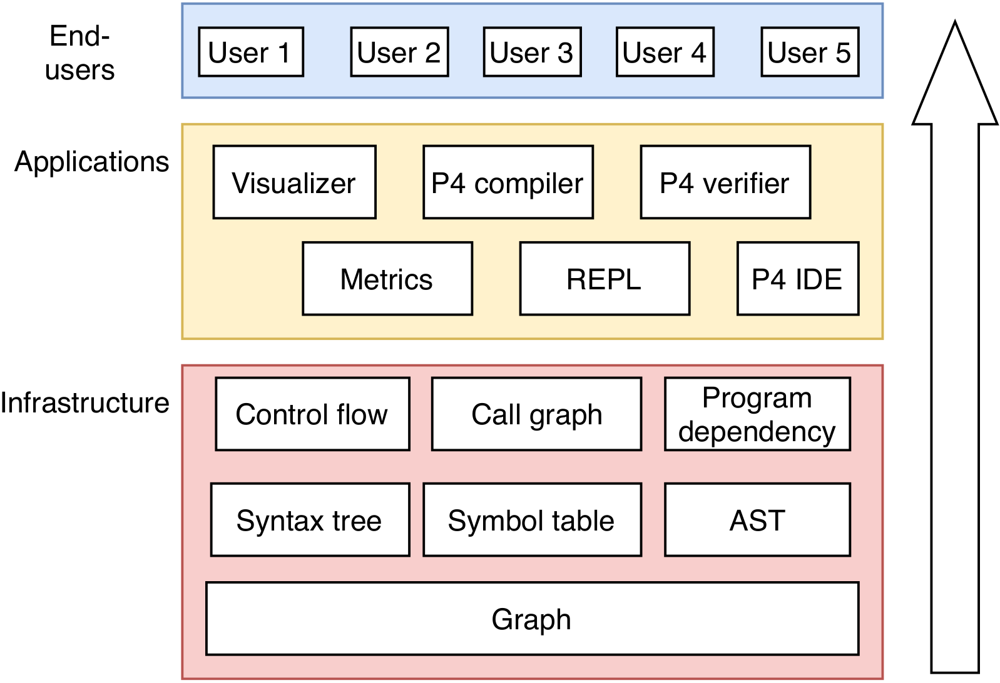

# Developer guide

This is a general guide for P4Query contributors. Other articles of interest:

- [Application developers guide](contributing/application-developer.md)
- [Infrastructure developers guide](contributing/infrastructure-developer.md)
- [Testers guide](contributing/tester.md)
- [Maintainers guide](contributing/maintainer.md)

## Intented audience

The tool is developed by students in the P4 laboratory at Eötvös Loránd University.

## Importing the project

It should be possible to import the repository root as a folder in VSCode or [VSCodium](https://vscodium.com/).

Target is Java 8. (See section below on how to setup VSCode for Java 8.)

Recommended extensions for VSCode: 

- Java Extension Pack (Microsoft), 
- Language Support for Java (Red Hat), 
- Maven for Java (Microsoft).  

For visualisation, you will need [Graphviz](https://graphviz.org/download/) (tested with 2.38.0).

For running the project using VSCode, you can set arguments for launching `broker.App` (current file) inside `launch.json`.

For running the project outside VSCode, you have to add arguments inside `exec-maven-plugin` plugin in the `pom.xml` inside the `controller` module, e.g.:

```xml
<mainClass>controller.Main</mainClass>
<arguments>
  <argument>draw</argument>
  <argument>--help</argument>
</arguments>
```

Then, you can run the project with the command:

```sh
$ mvn exec:java
```

Or with less Maven noise: 

```sh
$ mvn exec:java -pl controller
```

### VSCode and Java 8

The VSCode Java plugin requires Java 11 or newer, but projects can still be built using Java 8. 

Press `Ctrl+,` and in the "User" tab, search for `java.configuration.runtimes`. Click "Edit in settings.json", and add the following (correct the `path` field to your local setup): 

```
"java.configuration.runtimes": [{
  "name": "JavaSE-1.8",
  "path": "/usr/lib/jvm/java-8-openjdk-amd64",
  "default": true
}],
```

After that, issue an `mvn clean` and clean the workspace.


## Navigating the code 

`p4query` has a layered architecture. End-users only interact with applications. Applications in turn interact with knowledge graph in the infrastructure layer.

<figure>
  
  <figcaption>Figure: High-level architecture</figcaption>
</figure>

### Current code structure 


The code base is modular, and all modules are in the root directory (a requirement by Maven for multi-module projects). In theory each module could be developed and stored in a separate git repository, and then imported as submodule in the main project repository. 

- `blackboard`: Knowledge graph (Gremlin Server) and possibly further data access layers. 
- `broker`: Component for coordinating access to the `blackboard` by various actors. Currently implemented as a DAG in Ant.
- `experts-...`: Experts (actors, knowledge sources) that know how to derive new information from existing knowledge. When these are invoked by the `broker`, they connect to the `blackboard`, analyse its content, and add new information.
- `application-...`:  TODO
- `ontology`: Metadata shared between actors that prescribes/describes what kind of data they should put into the database.

Expanded view of the components:

<figure>
  
  <figcaption>Figure: Component dependency (illustration)</figcaption>
</figure>

### Gremlin

The P4 knowledge graph resides in a TinkerPop graph database. Database queries for TinkerPop are graph traversals written in the Gremlin programming language. Basically, Gremlin is a functional programming language, and programs are descriptions of the graph paths that you want to traverse, and the side-effects you want to set off during your traversal (somewhat similar to XQuery).

- Tutorial: https://tinkerpop.apache.org/docs/current/#tutorials
- Cookbook: http://kelvinlawrence.net/book/PracticalGremlin.html
- Reference documentation: https://tinkerpop.apache.org/docs/current/reference/#graph-traversal-steps
- Gremlin white paper: https://arxiv.org/pdf/1508.03843.pdf
- Javadoc:
  * http://tinkerpop.apache.org/javadocs/3.4.8/full/org/apache/tinkerpop/gremlin/structure/package-summary.html
  * http://tinkerpop.apache.org/javadocs/3.4.8/full/org/apache/tinkerpop/gremlin/process/traversal/package-summary.html


### Tips

Use the visualizer module to explore the graph. If you introduce a new analysis, modify the visualization module to visualize the results of your analysis as well.

Take advantage of database persistance to speed up development (`-s` option). You will need the `--readonly` option as well so your own modifications will not be persisted, and you will be able to always experiment with the same database.


