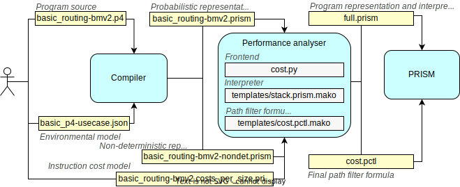

# Performance prediction for P4

## Description

This is a proof-of-concept tool for automatically predicting execution time, or any other costs for P4, using only the source code and environmental models.

Please note that the software is in early stages and was not thorougly tested yet, but it should be able to handle small modifications to the source code and the models.

The tool has two large components:

- **Compiler**: This one turns P4 source code and models into a representation used for performance prediction. This part was built using P4Query. 
- **Performance analyser**: This one is using [PRISM](https://www.prismmodelchecker.org/) to execute performance prediction over the representation generated by the compiler.

We unbundled the two components so **you can try the Performance analyser without the Compiler** (and having to deal with P4Query).

## Performance analyser

This stand-alone component can be downloaded from [experts-smc/cost-analysis](../../experts-smc/cost-analysis). Python script [`cost.py`](../../experts-smc/cost-analysis/cost.py) is a frontend to supplying a compiled P4 representation to PRISM.

### Getting started

Dependencies: 

- Python 3.8.10 (other versions were not tested)
- Mako 1.1.0 package (install it using  `pip install mako`)
- [PRISM 4.7](https://github.com/prismmodelchecker/prism)

Basic usage information (i.e. command line arguments) can be queried with the `-h` flag:

```sh
$ ./cost.py -h
```

At minimum [`cost.py`](../../experts-smc/cost-analysis/cost.py) expects three arguments:

- Path to the compiled respresentation of the P4 program (see e.g. [basic_routing-bmv2.prism](../../experts-smc/cost-analysis/examples/basic_routing-bmv2/basic_routing-bmv2.prism))
- `-c` flag: Path to the cost model, assigning costs to primitive instructions (see e.g. [basic_routing-bmv2.costs_per_size.prism](../../experts-smc/cost-analysis/examples/basic_routing-bmv2/basic_routing-bmv2.costs_per_size.prism))
- `-p` flag: The path to the PRISM root directory on your system.

For example, the following command will start-up PRISM and calculate the performance for the [basic_routing-bmv2.p4](../../experts-smc/cost-analysis/examples/basic_routing-bmv2/basic_routing-bmv2.p4) program. The analysis requires full state-space traversal, and it can take 10-20 minutes depending on your system.

```sh
$ ./cost.py examples/basic_routing-bmv2/basic_routing-bmv2.prism \
            -c examples/basic_routing-bmv2/basic_routing-bmv2.costs_per_size.prism \
            -p $PATH_TO_PRISM 
```

By default, the average performance is calculated, with one of the cost counters (called "`reward`" in PRISM) in the cost models (see [basic_routing-bmv2.costs_per_size.prism](../../experts-smc/cost-analysis/examples/basic_routing-bmv2/basic_routing-bmv2.costs_per_size.prism)). You can use the `-g` flag to choose a different goal: 

- `avg` : Calculates the average performance over all execution paths, using the `"avg_case"` cost counter in the cost model.
- `best` : Calculates the performance of the least expensive execution path, using the `"best_case"` cost counter in the cost model.
- `worst` :Calculates the performance of the most expensive execution path,, using the `"worst_case"` cost counter in the cost model.
- `avg_best` : Calculates the average performance over all execution paths, using the `"best_case"` cost counter in the cost model.
- `avg_worst` : Calculates the average performance over all execution paths, using the `"worst_case"` cost counter in the cost model.

Note that `best` and `worst` goals rely on non-deterministic program model instead of a probabilistic one due to [technicalities about PRISM](https://groups.google.com/g/prismmodelchecker/c/vKdGTO4upI0/m/KzHQFMl3ukwJ "the min and max values only represent the min or max *expected* value under the different possible resolutions of the nondeterminism and not the probabilistic choices (there is no min/max for DTMCs as there is no nondeterminism)"). The compiler automatically generates these as well, and suffixes them with the `-nondet` prefix (see e.g. [basic_routing-bmv2-nondet.prism](../../experts-smc/cost-analysis/examples/basic_routing-bmv2/basic_routing-bmv2-nondet.prism)). Do not give these files as arguments: [`cost.py`](../../experts-smc/cost-analysis/cost.py) will automatically add the suffix if you give non-deterministic goals to `-g`.

A simple way to experiment with the software is to the change numbers in [basic_routing-bmv2.costs_per_size.prism](../../experts-smc/cost-analysis/examples/basic_routing-bmv2/basic_routing-bmv2.costs_per_size.prism). The structure of the cost model file is detailed in the following section.  

To create analysable representations for other P4 programs, see the Compiler section.


### How it works

<figure>
  
  <figcaption>Figure: Components and data flow</figcaption>
</figure>

We used the compiler to translate P4 source code (e.g. [basic_routing-bmv2.p4](../../experts-smc/cost-analysis/examples/basic_routing-bmv2/basic_routing-bmv2.p4)) into analysable representation (e.g. [basic_routing-bmv2.prism](../../experts-smc/cost-analysis/examples/basic_routing-bmv2/basic_routing-bmv2.prism)). This file contains rules in PRISM's syntax. For a more human-readable (bytecode-like) format, see [basic_routing-bmv2.p4.asm](../../experts-smc/cost-analysis/examples/basic_routing-bmv2/basic_routing-bmv2.p4.asm).

This rule set is partial, and must be extended with a rule set describing how PRISM should interpret these "high-level" rules. These rules can be read in [templates/stack.prism.mako](../../experts-smc/cost-analysis/templates/stack.prism.mako), a Mako template which is automatically instantiated, and merged with [basic_routing-bmv2.prism](../../experts-smc/cost-analysis/examples/basic_routing-bmv2/basic_routing-bmv2.prism) by [`cost.py`](../../experts-smc/cost-analysis/cost.py) into a proper PRISM file. (For debugging purposes, the generated file is also saved into the `generated` folder.)

Cost models (e.g. [basic_routing-bmv2.costs_per_size.prism](../../experts-smc/cost-analysis/examples/basic_routing-bmv2/basic_routing-bmv2.costs_per_size.prism)) are currently generated manually. In the `rewards` section of the PRISM cost model, we assign "rewards" (possibly negative rewards, i.e. costs) to program states. For example, we can incur a cost, whenever a specific instruction is reached (i.e. whenever the program counter is set to a certain number).

By using a PCTL formula, PRISM lets us select/filter specific execution paths that will be cost analysed. One such formula (that selects all terminating paths) can be found in [templates/cost.pctl.mako](../../experts-smc/cost-analysis/templates/stack.prism.mako), a Mako template which again is automatically instantiated by [`cost.py`](../../experts-smc/cost-analysis/cost.py), based on the goal selected by the user. 


## Compiler

The compiler component translates P4 source code (e.g. [basic_routing-bmv2.p4](../../experts-smc/cost-analysis/examples/basic_routing-bmv2/basic_routing-bmv2.p4)) to performance analysable representation (e.g. [basic_routing-bmv2.prism](../../experts-smc/cost-analysis/examples/basic_routing-bmv2/basic_routing-bmv2.prism)). 

### Getting started

The compiler component was implemented using P4Query. General usage information about P4Query can be found in its [User guide](docs/user_guide.md).

To run the compiler, you have to download P4Query, and start the `smc` (stack machine compiler) application.

Basic usage information (i.e. command line arguments) can be queried with the `--help` flag:

```sh
$ ./p4query smc --help
```

The `smc` application expects the following arguments:

- The original P4 source code 
- `-o` flag: Path to an arbitrary target directory where the output (analysable representation) will be created. 
- `-u` flag: An environmental model description in JSON format (see later).

Other general arguments of P4Query (e.g. `-s`) are also accepted. 

For example, the following command will compile [basic_routing-bmv2.p4](../../experts-smc/cost-analysis/examples/basic_routing-bmv2/basic_routing-bmv2.p4) program to `$TARGET_DIR/basic_routing-bmv2.p4.prism`. In case you do not use the `-s` flag or this is the first time P4Query is executed, the full analysis will take 10-15 seconds or more, depending on your system.  

```sh
$ ./p4query smc \
            "cost-analysis/examples/basic_routing-bmv2/basic_routing-bmv2.p4" \
            -o $TARGET_DIR \
            -u "cost-analysis/examples/basic_routing-bmv2/basic-p4-usecase.json"
```

### Environmental models

The compiler currently accepts very simple environmental models. An example can be found in [basic-p4-usecase.json](../../experts-smc/cost-analysis/examples/basic_routing-bmv2/basic-p4-usecase.json). 

This is currently a manually generated JSON document that specifies 

- the contents of the **match-action tables** in the [basic_routing-bmv2.p4](../../experts-smc/cost-analysis/examples/basic_routing-bmv2/basic_routing-bmv2.p4) program, and 
- the **packet distribution** of the expected traffic.

As the schema will likely be improved in the future, we do not yet give a formal schema definition, and only make a few remarks instead:

- Match-action table keys are given as numbers (these are parsed as `BigInteger`s, later translated to binary sequence). Masks and action parameters are not yet supported.
- Packet probabilities are given as fractions (to avoid floating-point issues).
- For concisness, in case of `ethernet` and `ipv4` headers the schema can be omitted, in which case a built-in schema will be used, and data fields will be initialized to 0. 

